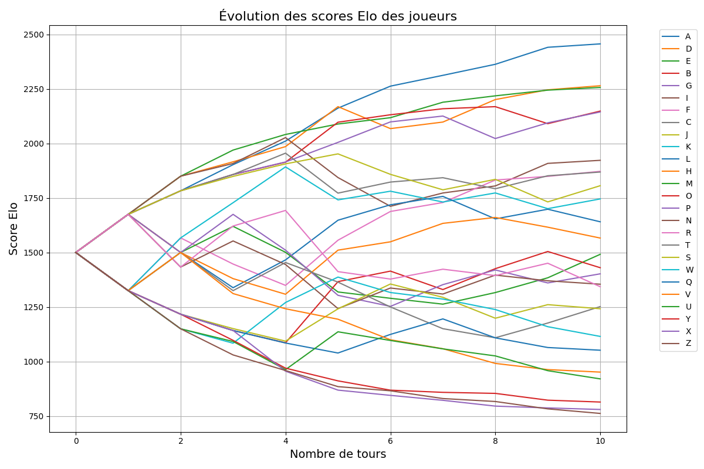
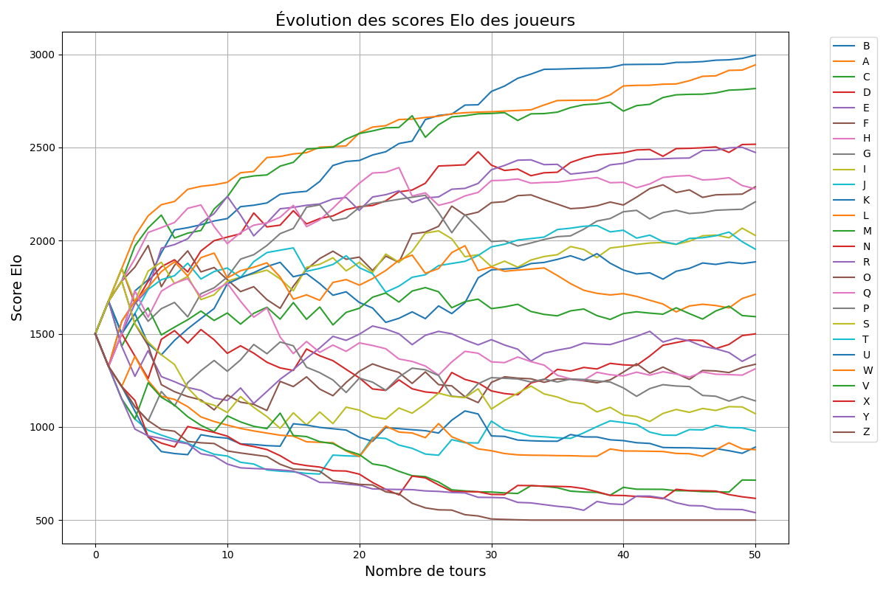
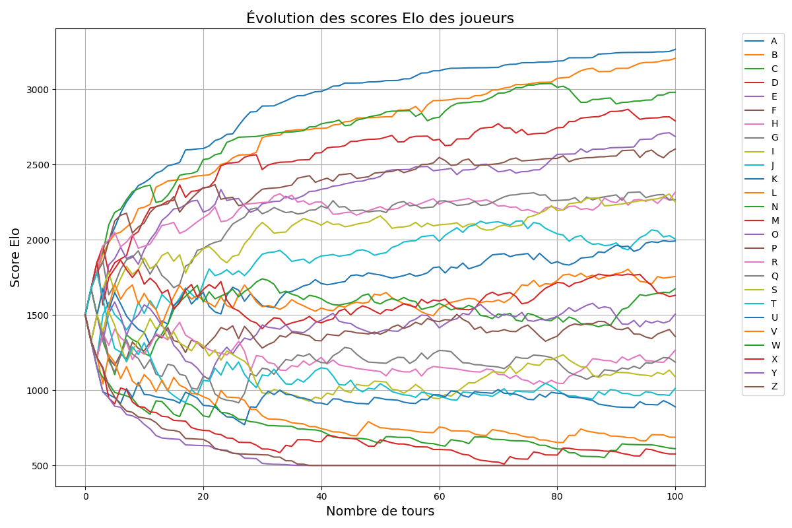
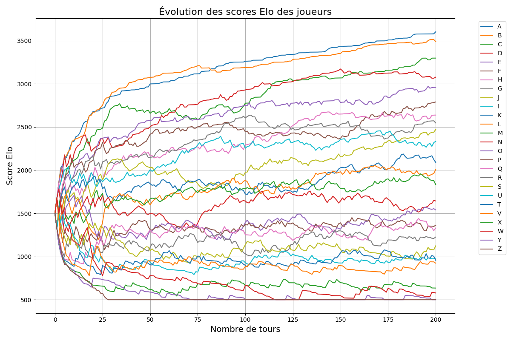
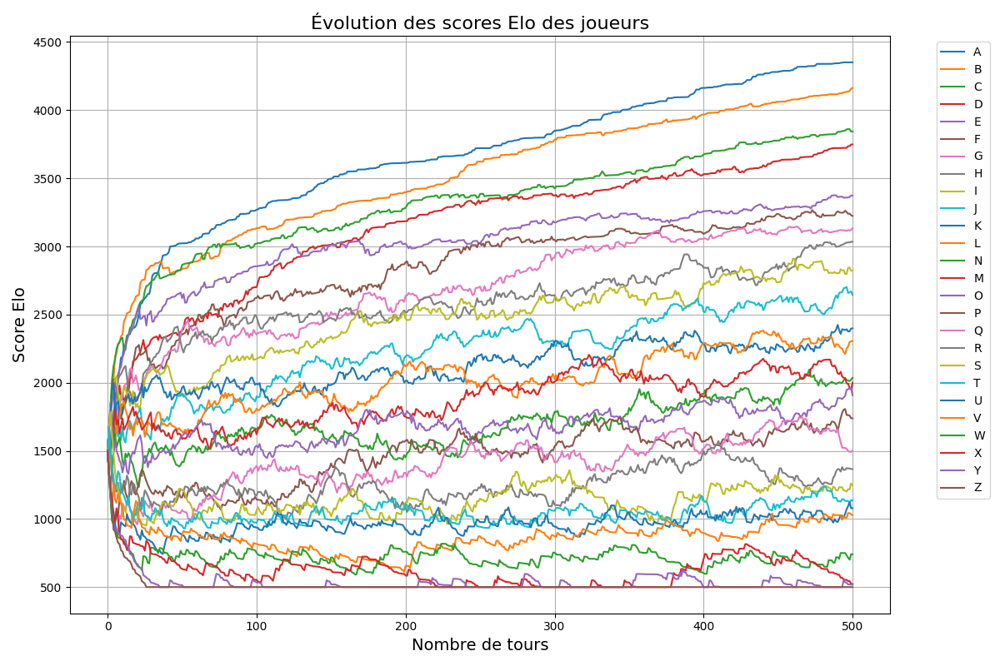
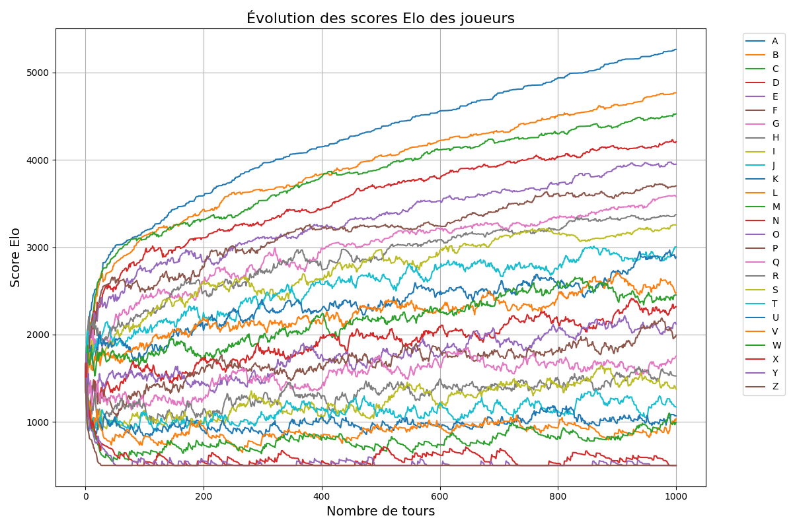

# Simulation Elo System

Ce projet propose une simulation d'un système de classement Elo pour 26 joueurs fictifs nommés de A à Z. Chaque joueur possède un niveau intrinsèque défini, influençant la probabilité de victoire lors des matchs.

La simulation met en œuvre les mécanismes suivants :
- **Calcul des probabilités de victoire** à partir des scores Elo.
- **Mise à jour des scores Elo** en fonction des résultats des matchs, avec des ajustements pour limiter les pertes Elo des joueurs en dessous d'un certain seuil.
- **Visualisation des évolutions de scores Elo** pour suivre la progression des joueurs.

---

## Fonctionnement du Modèle

### 1. **Probabilité de victoire**
La probabilité qu'un joueur A batte un joueur B peut être calculée comme suit :

```python
P_A_gagne = 10**(Elo_A / 1000) / (10**(Elo_A / 1000) + 10**(Elo_B / 1000))
```
2. Mise à jour du score Elo

Le score Elo est mis à jour après chaque match selon la formule suivante :
```python
Elo_A_n_plus_1 = Elo_A_n + K * (W - P_A_gagne)
```
Où :

- Elo_A_n_plus_1 : nouveau score Elo du joueur A.
- Elo_A_n : ancien score Elo du joueur A.
- K : facteur d'ajustement, dépendant du nombre de parties jouées et du score actuel.
- W : résultat du match (1 pour une victoire, 0.5 pour un match nul, 0 pour une défaite).
- P_A_gagne : probabilité calculée de victoire du joueur A.

3. Facteur d'ajustement (K)

Le facteur K varie en fonction de plusieurs critères :

- K = 700 pour les 5 premières parties.
- K = 400 pour les parties 6 à 30.
- K = 200 pour un score Elo inférieur à 3000.
- K = 100 pour un score Elo égal ou supérieur à 3000.

4. Limitations Elo

Pour éviter des dérives dans les scores :

- Aucun joueur ne peut descendre en dessous de 500 points Elo.
- Les pertes de points sont réduites de moitié pour les joueurs ayant moins de 1000 points Elo.

Simulations et Visualisations

Le projet inclut des visualisations de l'évolution des scores Elo des joueurs sur différents nombres de matchs. Voici quelques exemples de simulations :

Simulation 10 Parties


Simulation 50 Parties


Simulation 100 Parties


Simulation 200 Parties


Simulation 500 Parties


Simulation 1000 Parties


Installation et Exécution
Prérequis : 
- Python 3.x 
- Bibliothèques Python : numpy, matplotlib

Instructions

Clonez le dépôt :

```
git clone https://github.com/dualzone/simulation-elo.git
cd simulation-elo
```

Installez les dépendances si nécessaire :

```
pip install -r requirements.txt
```

Lancez la simulation :
```
python simulation_elo.py
```
Les graphiques seront générés et affichés automatiquement.

Personnalisation

- Nombre de joueurs : Modifiez la variable `n_players`.
- Niveaux intrinsèques : Ajustez la plage dans `intrinsic_levels`.
- Nombre de parties : Changez la valeur de `n_rounds`.

Contribuer
Les contributions sont les bienvenues ! Si vous souhaitez améliorer ce projet, veuillez ouvrir une issue ou soumettre une pull request.
